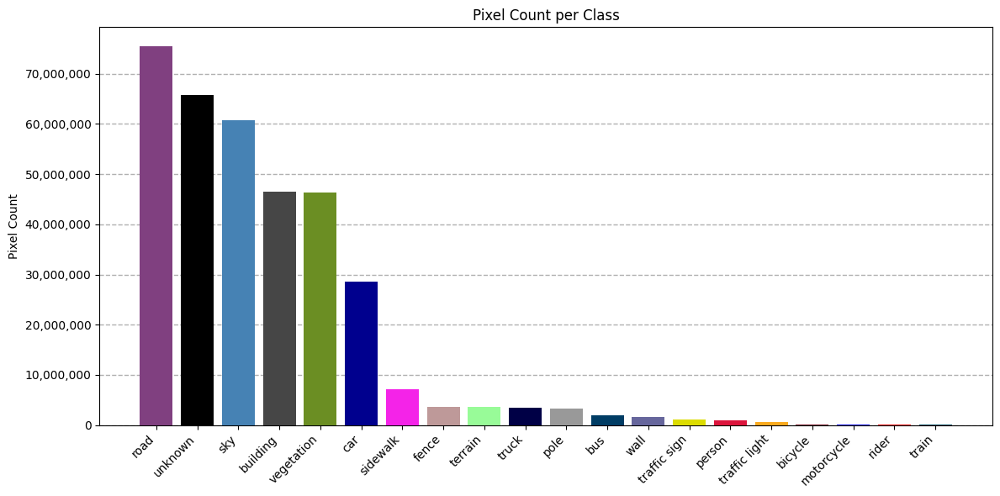

# U-Net Variants for Semantic Segmentation in Autonomous Driving

This project evaluates the performance of three semantic segmentation models — **U-Net**, **Swin U-Net**, **Mamba U-Net** and **HMT U-Net** — in the context of **autonomous driving** using the **BDD100K semantic segmentation dataset**.

---

## 🚗 Dataset

We use the **BDD100K Semantic Segmentation Subset**, which consists of:

- 7,000 training images  
- 1,000 validation images  
- Images labeled with 20 semantic classes relevant to urban driving scenes

### Class Label Map

The classes present in the dataset are:

```python
LABEL_MAP = {  
0: "road",  
1: "sidewalk",  
2: "building",  
3: "wall",  
4: "fence",  
5: "pole",  
6: "traffic light",  
7: "traffic sign",  
8: "vegetation",  
9: "terrain",  
10: "sky",  
11: "person",  
12: "rider",  
13: "car",  
14: "truck",  
15: "bus",  
16: "train",  
17: "motorcycle",  
18: "bicycle",  
19: "unknown"  
}
```

The dataset presents a long-tail distribution, with common classes like "road" and "sky" dominating over rare ones like "train", "motorcycle", or "rider".

This dataset has a severe class imbalance:



---

## 🔍 Objective

The goal is to compare architectural performance in handling imbalanced multi-class segmentation, particularly with regard to:

- Pixel Accuracy (PA)
- Mean Pixel Accuracy (mPA)
- Mean IoU (mIoU)
- Frames per second (FPS)

---

## 🧠 Models Compared

| Model        | Architecture Highlights                                 | Parameters |
|--------------|----------------------------------------------------------| --------- |
| U-Net        | Classic CNN-based encoder-decoder with skip connections | 31.0 M |
| Swin U-Net   | Transformer-based encoder (Swin Transformer) with hierarchical representations | 27.2 M |
| Mamba U-Net  | State Space Model-based encoder with long-range temporal dynamics | 19.1 M |
| HMT U-Net  | Hybrid U-Net implementation with CNN, transformer and mamba blocks | 60.4 M |

---

## ⚙️ Environment Setup

To reproduce the results, create a Conda environment using the provided YAML file:

```bash
conda env create -f environment_unet.yml  
conda activate unet_segmentation_env
```

All required libraries, including PyTorch, and model-specific dependencies, are included.

---

## 📈 Training Details


We used **Weights & Biases (WandB)** for experiment tracking, including loss curves, metric visualization, and checkpoint logging. If you're running the training scripts yourself, make sure to log into WandB first:

```bash
wandb login
```

The specifics of the training for each model is detailed in [training.md](training.md).

---

## 📁 Directory Structure

```bash
.
├── environment_unet.yml      # Conda environment definition  
├── data/                     # BDD100K Semantic Segmentation Dataset
├── src/                      # Code for experiments and models
    ├── models/                   # U-Net, Swin U-Net, Mamba U-Net, HMT U-Net architectures
        ├── unet.py                   # U-Net model pytorch implementation
        ├── swin_unet.py              # Swin U-Net model pytorch implementation
        ├── mamba_unet.py             # Mamba U-Net model pytorch implementation
        ├── hmt_unet.py               # HMT U-Net model pytorch implementation
        └── lightning_model.py        # General pytorch lightning segmentation model implementation

    ├── experiments/              # Experimental setup for all models
        ├── e0_unet.py                # Experiment 0: Experimental setup for training and validating U-Net
        ├── e1_swin_unet.py           # Experiment 1: Experimental setup for training and validating Swin U-Net
        ├── e2_mamba_unet.py          # Experiment 2: Experimental setup for training and validating Mamba U-Net
        └── e3_hmt_unet.py            # Experiment 2: Experimental setup for training and validating HMT U-Net

    ├── configuration.py          # Experimental hyperparameters and utility variables to train the models
    ├── data_loader.py            # Datamodules and dataloaders to load the training and validation data
    ├── explainability.py         # Complementary functions to calculate explicability mechanisms such as Saliency
    ├── loss.py                   # Unified Focal Loss pytorch implementation
    └── utils.py                  # Special functions to get and set torch specifics

└── README.md  
```

---

## 📜 License

This project is released under the MIT License.

---

## 🤝 Acknowledgements

### Dataset

- BDD100K Dataset: https://www.kaggle.com/datasets/solesensei/solesensei_bdd100k

### Code

- Swin U-Net code: https://github.com/microsoft/Swin-Transformer  
- Mamba U-Net code: https://github.com/ziyangwang007/Mamba-UNet 

### Architectures

- U-Net architecture: https://arxiv.org/abs/1505.04597
- Swin U-Net architecture: https://arxiv.org/abs/2105.05537
- Mamba U-Net architecture: https://arxiv.org/abs/2402.05079
